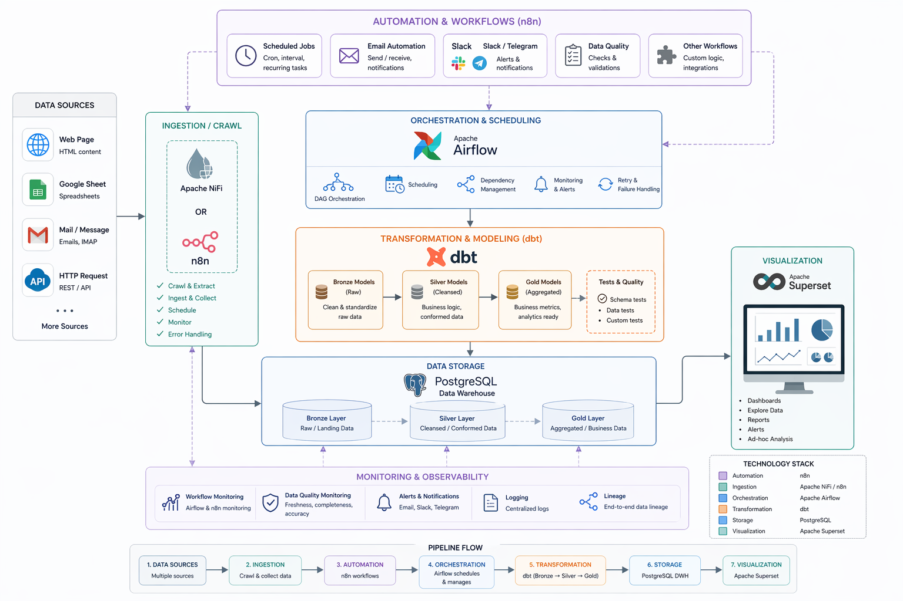

# Unified Data Platform

> A modular data platform for ingestion, automation, orchestration, transformation, warehousing, and business intelligence.

This repository contains the **overall project structure** for a modern data pipeline built around **Apache NiFi / n8n**, **PostgreSQL**, **Apache Airflow**, **dbt**, and **Apache Superset**.

The platform is designed to collect data from multiple operational sources, automate ingestion workflows, transform datasets across warehouse layers, and expose analytics-ready data for dashboards and reporting.

## Architecture Diagram

> Add your architecture image to `docs/architecture.png` and keep the block below in this README.

<p align="center">
  
</p>

---

## System Overview

The architecture follows this high-level flow:

**Data Sources → Ingestion / Automation → Transformation & Orchestration → PostgreSQL Warehouse → Visualization**

### Data Sources
The platform can ingest data from multiple sources, including:

- Web pages
- Google Sheets
- Mail messages
- HTTP requests / APIs

### Ingestion Layer
The ingestion layer is responsible for collecting raw data from source systems.

- **Apache NiFi** supports crawling, extraction, routing, and ingestion flows
- **n8n** can also support ingestion workflows where needed

### Automation Layer
In addition to ingestion, **n8n** is used for automation-related workflows such as:

- Scheduled jobs
- Notifications
- Workflow triggers
- Lightweight integrations
- Operational automation tasks

### Transformation & Orchestration Layer
After raw data is collected, the platform uses:

- **Apache Airflow** for orchestration, scheduling, dependency management, and workflow control
- **dbt** for modeling and transforming data through warehouse layers

The transformation flow is organized into:

- **Bronze**: raw or landing data
- **Silver**: cleaned and standardized data
- **Gold**: business-ready, analytics-ready data

### Storage Layer
Processed datasets are stored in **PostgreSQL**, which acts as the central analytical warehouse serving downstream use cases.

### Visualization Layer
Business users and analysts consume curated datasets in **Apache Superset** for:

- Dashboards
- Reports
- Ad hoc exploration
- KPI monitoring

---

## Architecture Principles

This project is organized around a few core principles:

- **Modular services**: each major component lives in its own folder and can evolve independently
- **Separation of concerns**: ingestion, orchestration, transformation, and visualization are clearly separated
- **Layered data modeling**: warehouse models are structured from bronze to silver to gold
- **Documentation by component**: implementation and setup details are documented inside each service folder
- **Project-level overview**: this README focuses only on the overall architecture and repository organization

---

## Repository Structure

```text
airflow-pipeline/
├── config/                # Shared configuration for the platform
├── dags/                  # Airflow DAG definitions
├── dbt/                   # dbt project for bronze / silver / gold transformations
├── plugins/               # Airflow plugins and custom extensions
├── scripts/               # Utility and helper scripts
├── n8n/                   # n8n service and automation workflows
├── nifi/                  # NiFi service for crawling and ingestion
├── superset/              # Superset service for dashboards and BI
├── Dockerfile             # Main container build definition
├── docker-compose.yaml    # Core platform service composition
├── requirements.txt       # Python dependencies
├── QUICKSTART.md          # Quickstart guide
├── STRUCTURE.md           # Additional repository structure notes
└── README.md              # Project overview (this file)
```

---

## Component Responsibilities

### Apache NiFi
Responsible for source connectivity and ingestion-focused pipelines.

Typical responsibilities:
- Crawl web-based sources
- Pull data from APIs
- Process mail-based inputs
- Route and deliver raw data into storage

### n8n
Responsible for automation and workflow support across the platform.

Typical responsibilities:
- Trigger scheduled workflows
- Send notifications or alerts
- Run operational automations
- Connect external services with lightweight logic

### Apache Airflow
Responsible for orchestrating the platform’s scheduled data workflows.

Typical responsibilities:
- Schedule pipeline execution
- Manage task dependencies
- Monitor DAG runs
- Coordinate transformation jobs

### dbt
Responsible for SQL-based transformation and data modeling.

Typical responsibilities:
- Transform raw data into structured models
- Standardize intermediate datasets
- Build business-ready marts
- Maintain lineage and testing across models

### PostgreSQL
Acts as the central warehouse for ingested and transformed data.

Typical responsibilities:
- Store raw landing data
- Persist silver-layer curated datasets
- Serve gold-layer analytical models
- Power downstream BI consumption

### Apache Superset
Responsible for analytics and reporting.

Typical responsibilities:
- Build dashboards
- Explore curated datasets
- Share reports with stakeholders
- Visualize KPIs and trends

---

## End-to-End Data Flow

1. Data is collected from source systems such as web pages, Google Sheets, mail messages, and HTTP endpoints.
2. NiFi and/or n8n ingest or trigger the raw data collection workflows.
3. Raw data is landed into PostgreSQL.
4. Airflow schedules and controls transformation workflows.
5. dbt transforms data from **bronze** to **silver** to **gold**.
6. Curated PostgreSQL datasets are exposed to Superset.
7. Superset delivers dashboards, reports, and analytics for end users.

---

## Documentation Scope

This README is intentionally limited to the **project overview**.

Detailed setup and implementation instructions are maintained in the dedicated component folders, including:

- `n8n/README.md`
- `nifi/README.md`
- `superset/README.md`
- Other service-specific documentation inside the repository

For environment-specific setup, service commands, and deployment details, refer to those local README files.

---

## Suggested Future Extensions

Depending on project needs, this architecture can be extended with:

- Data quality checks and alerting
- Centralized logging and observability
- Metadata and lineage tracking
- CI/CD for dbt and Airflow deployments
- Role-based access controls for BI assets
- Multi-environment deployment separation (dev / staging / prod)

---

## Summary

This repository represents a modular data platform where:

- **NiFi / n8n** handle ingestion and automation
- **Airflow** orchestrates workflows
- **dbt** transforms data across warehouse layers
- **PostgreSQL** stores analytical datasets
- **Superset** provides reporting and visualization

The repository is structured so each component can be documented and operated independently, while this top-level README provides the unified architectural view of the overall system.
